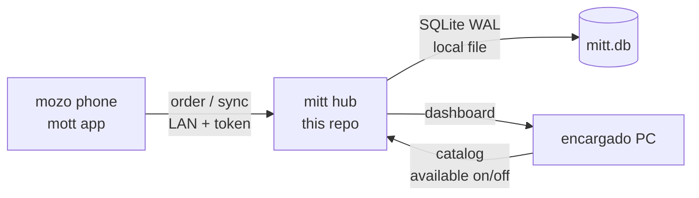

# mitt — PC hub for bar sales

The PC hub of a small-bar point of sale: product catalog, per-table tabs with automatic billing,
day dashboard, simple expense tracking, and a LAN API for offline-first mobile clients.

> **Status:** foundation complete and build-verified (`vet` + tests + Linux/Windows builds green).
> Not field-tested in a real bar yet — see [Limitations](#limitations).

## Contents

- [How it works](#how-it-works)
- [Quick start](#quick-start)
- [Pairing a phone](#pairing-a-phone)
- [API](#api)
- [Text dashboard](#text-dashboard)
- [Builds for Windows and Linux](#builds-for-windows-and-linux)
- [Project layout](#project-layout)
- [Data and backups](#data-and-backups)
- [Compatibility](#compatibility)
- [Roadmap](#roadmap)
- [Contributing](#contributing)
- [Limitations](#limitations)

## How it works



1. The **encargado** keeps the catalog on the PC (products, prices, available/out-of-stock).
2. Each **mesa** has one open **tab**. Waiters add products from the phone; the hub computes the total.
3. Closing a tab produces a **sale**. Purchases of supplies are recorded as **expenses**.
4. Phones work **offline** and sync a FIFO queue when the LAN is back.

## Quick start

Requirements: **Go 1.22+**. Pure Go, no CGO, no external services.

```bash
go run ./cmd/mitt
```

That starts the hub with a random pairing token (printed once), database `./mitt.db`,
listening on `:8080`. Useful flags:

| Flag    | Default     | Purpose                                     |
|---------|-------------|---------------------------------------------|
| `-db`   | `./mitt.db` | SQLite file location                        |
| `-addr` | `:8080`    | Listen address                              |
| `-token`| _(random)_  | Pairing token (pass a fixed one to reuse it)|
| `-ui`   | `none`      | `snapshot` prints the text dashboard & exits|

Checks:

```bash
make vet
make test
```

## Pairing a phone

1. Start the hub and copy the printed token (or set yours with `-token`).
2. On the phone (`mott` app): scan the hub QR or paste `mitt://pair?url=<hub-url>&token=<token>`.
3. The phone validates against `GET /api/health` with the token and saves the pairing.

Tokens travel as `Authorization: Bearer <token>`. Never commit a real token —
grep the repo if in doubt: `grep -ri token --include='*.go' . | grep -vi dummy` should show code only.

## API

Base: `http://<pc>:8080`. Auth: everything except `/api/health` needs the Bearer token.
Money is integer **cents**; times are RFC 3339.

| Method | Path                    | Purpose                              |
|--------|-------------------------|--------------------------------------|
| GET    | `/api/health`           | Liveness, no auth                    |
| GET    | `/api/products`         | List catalog (`?available=true`)     |
| POST   | `/api/products`         | Create product                       |
| PATCH  | `/api/products/{id}`    | Rename / reprice / toggle available  |
| POST   | `/api/tabs`             | Open tab for a table                 |
| GET    | `/api/tabs/open`        | List open tabs                       |
| POST   | `/api/tabs/{id}/items`  | Add product × qty to tab             |
| POST   | `/api/tabs/{id}/close`  | Close tab → returns the sale         |
| GET    | `/api/expenses`         | List expenses                        |
| POST   | `/api/expenses`         | Record a purchase                    |

Typical sale, end to end:

```bash
T=YOUR_TOKEN; B=http://localhost:8080
curl -H "Authorization: Bearer $T" $B/api/products
curl -s -H "Authorization: Bearer $T" -H 'Content-Type: application/json' \
  -d '{"name":"Quilmes","price_cents":120000}' $B/api/products
TAB=$(curl -s -H "Authorization: Bearer $T" -H 'Content-Type: application/json' \
  -d '{"table_id":"mesa-3"}' $B/api/tabs | python3 -c "import json,sys; print(json.load(sys.stdin)['tab']['id'])")
PID=$(curl -s -H "Authorization: Bearer $T" $B/api/products | python3 -c "import json,sys; print(json.load(sys.stdin)['products'][0]['id'])")
curl -s -H "Authorization: Bearer $T" -H 'Content-Type: application/json' \
  -d "{\"product_id\":\"$PID\",\"qty\":2}" $B/api/tabs/$TAB/items
curl -s -H "Authorization: Bearer $T" -X POST $B/api/tabs/$TAB/close
```

Field shapes and error envelopes are also sketched in [`docs/api.md`](docs/api.md).

## Text dashboard

Zero-dependency overview (works over SSH, any distro):

```bash
go run ./cmd/mitt -ui snapshot
```

Shows open tables with items and totals, today's sales, and catalog status
(signals are text + symbol, never color-only). A graphical shell
(Fyne vs Wails — decision open) will plug behind `internal/ui.DashboardService`;
see [`docs/dashboard.md`](docs/dashboard.md) and [`docs/design-tokens.md`](docs/design-tokens.md)
(shared with the mobile app so both stay visually consistent).

## Builds for Windows and Linux

```bash
make build-linux    # ./mitt-linux-amd64
make build-windows  # ./mitt-windows-amd64.exe
```

Single static-ish binaries (Go + pure-Go SQLite, no CGO), so they run from
Windows 10 up and on any mainstream Linux distro with no extra runtime.

## Project layout

| Path                          | Purpose                                              |
|-------------------------------|------------------------------------------------------|
| `cmd/mitt/`                   | Entrypoint: flags, store open, HTTP serve, `-ui` mode|
| `internal/domain/`            | Bar rules: product, table, tab, sale, expense + tests|
| `internal/store/`             | SQLite WAL storage, migrations, repositories + tests |
| `internal/api/`               | LAN HTTP API + Bearer pairing middleware + tests     |
| `internal/ui/`                | UI seam: dashboard service port (graphical shells plug here)|
| `internal/tui/`               | Stdlib text dashboard proving the seam               |
| `docs/`                       | Architecture, API sketch, dashboard IA, design tokens|
| `PRODUCT.md`                  | Product context: users, flows, non-goals            |
| `odd/tasks/`                  | Local planning only — **not committed** (git-ignored)|

## Data and backups

- All data lives in the SQLite file (`-db`, default `./mitt.db`, git-ignored).
- WAL mode tolerates the hub and backups reading concurrently.
- Back up by copying `mitt.db` (plus `-wal`/`-shm` if present) while the hub runs —
  daily copy to a second disk is enough for a small bar.

## Compatibility

| Platform          | Supported from forces                               |
|-------------------|------------------------------------------------------|
| Windows           | 10 and up (`-amd64` binary, no installer needed)     |
| Linux             | Any distro that runs Go binaries (no CGO, no WebKit) |
| Phones            | Android 8+ via the `mott` app (LAN + pairing token)  |

## Roadmap

- Per-person split inside a table, divided tips.
- Electronic invoicing, suppliers, cloud/multisite.
- Graphical PC shell (Fyne vs Wails — plugs into `internal/ui`).
- `EncryptedSharedPreferences`-style secret storage guidance for clients.

## Contributing

Open source — adjust it to your bar's needs. Conventions:

- Conventional Commits (`feat:`, `fix:`, `docs:`, …), one work unit per commit.
- Tests travel with behavior: `go test ./...` must stay green.
- Keep the core UI-agnostic: new screens plug into `internal/ui`, never into domain.

## Limitations

- Today-sales in the text dashboard reads `0` until the sales reader lands (schema ready).
- Tables are addressed through open tabs; there is no standalone table-seeding endpoint yet.
- Native review of the foundation is pending maintainer consent (auth path) — tracked, not blocking.
